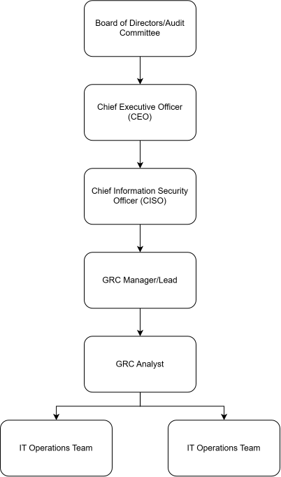

## Governance, Risk & Compliance (GRC) - The Architecture

The structural triad of Governance, Risk, and Compliance (GRC), representing the integrated strategy an organization uses to ensure it acts ethically, manages threats effectively, and meets legal obligations.

Organizations often fail not because of a lack of technical tools, but due to fragmented decision-making. When IT, legal, and executive teams operate in silos, security gaps emerge, compliance deadlines are missed, and financial losses occur. GRC provides the unified blueprint that ties technology investments directly to business strategy.

GRC is the corporate nervous system. Governance sets the tone and direction from the top down; Risk Management evaluates what could go wrong and prioritizes resources; Compliance ensures adherence to laws, regulations, and internal standards. Together, they transform security from a reactive burden into a proactive business enabler.

The Core Architecture
* **Governance**: Board-level oversight, policy-setting, and organizational alignment.
* **Risk Management**: Identifying, assessing, and mitigating threats (e.g., operational, financial, or cyber risks).
* **Compliance**: Meeting external mandates (like data protection laws) and internal policies.

### Where do the GRC Operations sit in an Organization?

### Baseline Fictional Scenario

OremaxPay anchors its operations in the bustling heart of Victoria Island, Lagos, serving as a vital bridge between unbanked merchants in Balogun Market and digital-first consumers across Nigeria. As a mid-sized fintech licensed by the Central Bank of Nigeria, the company processes upwards of two million mobile money transactions daily while maintaining strict compliance under the Nigeria Data Protection Act (NDPA).

**Core Operations and Transaction Flow**
The engine room of OremaxPay relies on a fault-tolerant microservices architecture capable of handling the erratic uptime and latency typical of West African telecommunications infrastructure. When a user initiates a transfer or merchant payment via USSD or the mobile app, the request hits a localized gateway integrated with the Nigeria Inter-Bank Settlement System (NIBSS). Transactions are tokenized instantly to prevent fraud, and settlement occurs in real-time or near-real-time across partner commercial banks. To mitigate downtime during fiber cuts or power outages on the mainland, OremaxPay utilizes a hybrid cloud model, keeping core routing logic redundant across multi-region edge servers.

**Governance, Risk, and Compliance (GRC) Oversight**
Operating under the watchful eye of GRC frameworks requires an uncompromising approach to data architecture. OremaxPay isolates Personally Identifiable Information (PII) from transaction payloads. Customer names, National Identification Numbers (NIN), and Bank Verification Numbers (BVN) are encrypted at rest using AES-256 and stored in secure, geo-fenced vaults compliant with local data sovereignty mandates.

The GRC team enforces continuous monitoring through automated compliance pipelines. Access to user data is governed by strict Role-Based Access Control (RBAC) and Zero-Trust principles, ensuring that even internal engineering teams cannot view raw customer credentials or transaction histories without multi-party authorization and audited cryptographic keys. Automated logging captures every access attempt, feeding directly into dashboards reviewed weekly by internal risk officers and external statutory auditors to satisfy both PCI-DSS standards and regulatory guidelines set by the Nigerian Data Protection Commission (NDPC).
